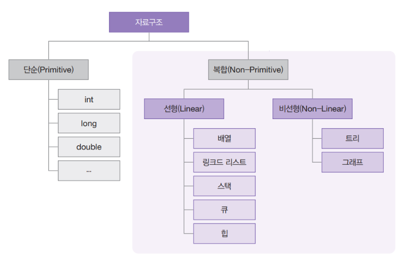
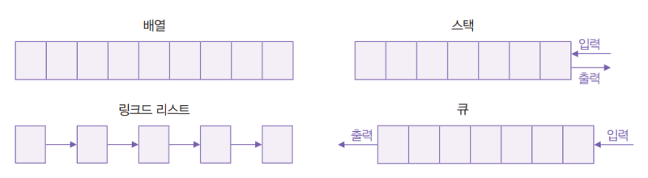
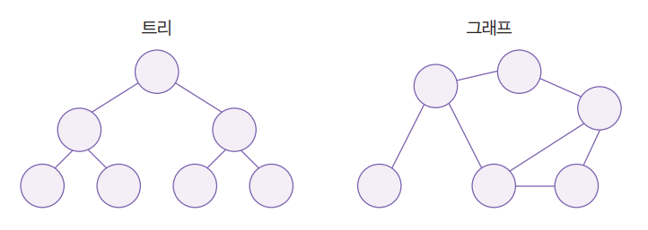
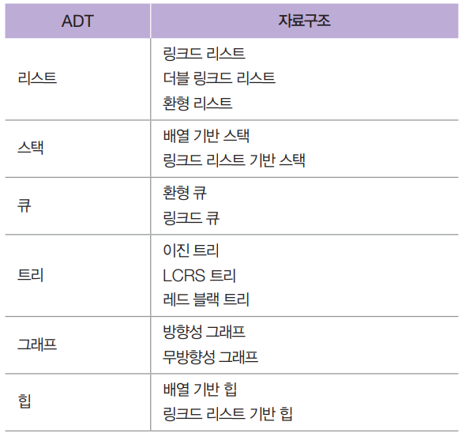

# 자료구조와 알고리즘

## 자료구조 (Data Structure)

자료구조는 컴퓨터가 데이터를 효율적으로 다룰 수 있도록 도와주는 **데이터 보관 방법과 데이터에 관한 연산의 총체**를 의미한다.

우리가 흔히 사용하는 `int` 역시 하나의 자료구조라고 볼 수 있다.
`int`는 32비트 메모리 공간 안에 수를 저장하고, 첫 번째 비트를 부호 표현에 사용하는 등의 **보관 방식**을 정의하고 있으며, 덧셈, 뺄셈, 곱셈, 나눗셈, 논리 연산, 시프트 연산 등 다양한 **연산** 또한 정의하고 있다.

---

## 자료구조의 분류

자료구조는 크게 다음과 같이 나뉜다.

* 단순 자료구조
* 복합 자료구조

사진 출처: 박상현, 이것이 자료구조+알고리즘이다. 

### 단순 자료구조

단순 자료구조는 프로그래밍 언어에서 기본적으로 제공하는 데이터 형식이다.

예시

* int
* float
* char
* bool

이러한 자료형은 프로그래밍 언어에서 기본적으로 제공된다.

---

### 복합 자료구조

복합 자료구조는 여러 데이터를 구조적으로 묶어서 사용하는 자료구조이다.

복합 자료구조는 다시 두 가지로 나뉜다.

* 선형 자료구조
* 비선형 자료구조

---

## 선형 자료구조

선형 자료구조는 데이터 요소가 **순차적으로 연결되는 구조**이다.

특징

* 구현이 비교적 쉽다
* 데이터 접근 구조가 단순하다

대표적인 선형 자료구조

* 배열 (Array)
* 연결 리스트 (Linked List)
* 스택 (Stack)
* 큐 (Queue)

사진 출처: 박상현, 이것이 자료구조+알고리즘이다. 

---

## 비선형 자료구조

비선형 자료구조는 데이터가 **순차적으로 연결되지 않는 구조**이다.

특징

* 하나의 노드가 여러 노드와 연결될 수 있다
* 계층 구조나 네트워크 구조를 표현하기 좋다

대표적인 비선형 자료구조

* 트리 (Tree)
* 그래프 (Graph)

사진 출처: 박상현, 이것이 자료구조+알고리즘이다. 

---

## ADT (Abstract Data Type)

ADT는 **추상 데이터 타입**을 의미한다.

자료구조의 **동작 방법을 정의한 개념적인 모델**이다.

즉, ADT는 다음을 정의한다.

* 데이터가 무엇인지
* 어떤 연산이 가능한지

하지만 **구현 방식은 정의하지 않는다.**

예를 들어 리스트의 ADT는 다음과 같은 연산을 제공한다.

* 접근 (Access)
* 추가 (Append)
* 삽입 (Insert)
* 삭제 (Delete)
* 탐색 (Search)

프로그래밍 언어에서 이러한 연산은 **함수 형태로 구현된다.**

---

## ADT와 자료구조의 관계

ADT는 **설계도**이고
자료구조는 **구현체**라고 볼 수 있다.

예를 들어 리스트를 배열로 구현한다고 가정해 보자.

* 배열의 길이 → 리스트의 길이
* 배열의 첫 요소 → 시작 노드
* 배열의 마지막 요소 → 마지막 노드
* 배열의 인덱스 → 현재 노드 위치

그리고 여기에 다음 기능을 구현하면 하나의 자료구조가 된다.

* 탐색
* 추가
* 삽입
* 수정
* 삭제

사진 출처: 박상현, 이것이 자료구조+알고리즘이다. 

---

## 자료구조를 공부해야 하는 이유

### 1. 적절한 자료구조 선택

자료구조를 이해하면 라이브러리를 사용할 때 **잘못된 자료구조 선택을 피할 수 있다.**

같은 ADT라도 구현 방식에 따라 성능이 크게 달라질 수 있다.

예시

* 네트워크 입출력 버퍼
  → 환형 큐가 링크드 큐보다 빠를 수 있다

* 메모리 효율이 중요한 상황
  → 링크드 큐가 더 유리할 수 있다

자료구조를 이해하면 이러한 선택을 논리적으로 할 수 있다.

---

### 2. 알고리즘 이해에 필수

자료구조는 알고리즘이 데이터를 효율적으로 사용할 수 있도록 도와주는 **핵심 구성 요소**이다.

따라서 자료구조를 모르면 알고리즘을 이해하기 어렵다.

---

# 알고리즘 (Algorithm)

알고리즘은 **어떤 문제를 해결하기 위한 단계적 절차**를 의미한다.

이 용어는 9세기 페르시아 수학자 **알 콰리즈미(Al-Khwarizmi)** 의 이름에서 유래했다.

---

## 알고리즘 설계와 구현

알고리즘을 설계한다는 것은

문제를 해결하기 위한 **논리적인 절차를 만드는 것**이다.

알고리즘을 구현한다는 것은

그 절차를 **프로그래밍 언어로 실제 코드로 작성하는 것**이다.

---

## 대표적인 고전 알고리즘

프로그래밍에서 자주 사용되는 대표적인 알고리즘

* 정렬 알고리즘
* 탐색 알고리즘
* 해싱 알고리즘

---

## 알고리즘 학습의 의미

알고리즘을 공부한다는 것은 다음을 의미한다.

* 문제를 분석하는 능력
* 해결 절차를 설계하는 능력
* 컴퓨터가 이해할 수 있는 형태로 구현하는 능력

또한 다음과 같은 자원을 고려해야 한다.

* 시간 복잡도 (Processing Power)
* 공간 복잡도 (Memory Usage)

---

## 알고리즘과 라이브러리

현대 프로그래밍 언어의 대부분은 다음과 같은 알고리즘을 **표준 라이브러리**로 제공한다.

* 정렬
* 탐색

알고리즘을 이해하면 상황에 따라 적절한 자료구조와 API를 선택할 수 있다.

예시

* 탐색 속도 중요
  → 해시 테이블

* 정렬 상태 유지 중요
  → 레드 블랙 트리

---

## 결론

알고리즘과 자료구조를 몰라도 프로그래밍은 할 수 있다.
하지만 **더 효율적인 프로그램을 만들기 위해서는 반드시 알아야 하는 핵심 개념**이다.
